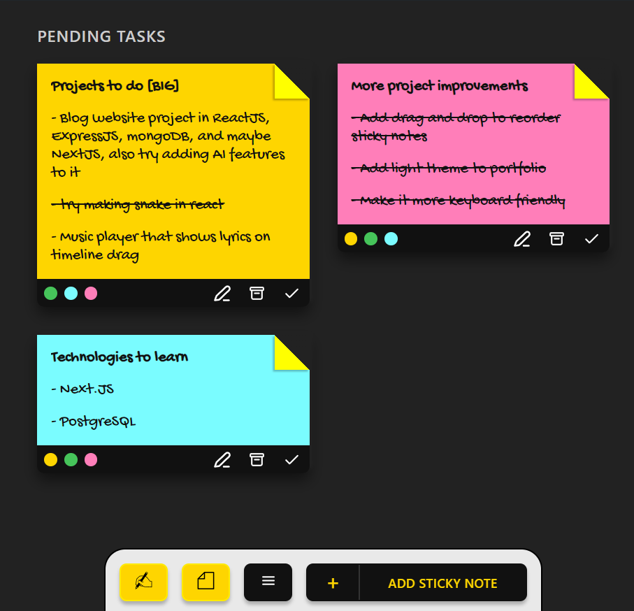

# Sticky notes app

A different take on a to-do list.

[Go stick a note](https://sticky-notes-react-js.vercel.app/)

## Features

- You can add upto 5 points to a single sticky note
- Available in 4 colors
- Has a 200 character limit
- Fold a note to favorite it
- Hover over a task to mark it complete individually
- Drag and drop sticky notes

##### Credits

- All icons taken from [SVGRepo](https://www.svgrepo.com/)
- Sticky note icons created by Andrean Prabowo - Flaticon
